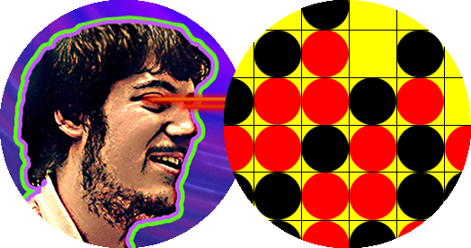

<!-- PROJECT SHIELDS -->
<!--
*** I'm using markdown "reference style" links for readability.
*** Reference links are enclosed in brackets [ ] instead of parentheses ( ).
*** See the bottom of this document for the declaration of the reference variables
*** for contributors-url, forks-url, etc. This is an optional, concise syntax you may use.
*** https://www.markdownguide.org/basic-syntax/#reference-style-links
-->

<!-- Possibly unnecessary template section

[![Contributors][contributors-shield]][https://github.com/EvanGottschalk]
[![Forks][forks-shield]][forks-url]
[![Stargazers][stars-shield]][stars-url]
[![Issues][issues-shield]][issues-url]
[![MIT License][license-shield]][license-url]
[![LinkedIn][linkedin-shield]][https://www.linkedin.com/in/evan-gottschalk/]

-->


<!-- PROJECT LOGO -->
<br />
<p align="center">
  <a href="https://github.com/EvanGottschalk/ConnectFour">
    
  </a>

  <h3 align="center">Connect Four</h3>

  <p align="center">
    A simple Python-based version of the game Connect Four. I created this as my final project for CS111 in 2011.
    <br />
    <a href="https://github.com/EvanGottschalk/ConnectFour"><strong>Explore the docs »</strong></a>
    <br />
    <br />
    <a href="https://www.youtube.com/watch?v=KN3nohBw_CE">View Demo</a>
    ·
    <a href="https://github.com/EvanGottschalk/ConnectFour/issues">Report Bug</a>
    ·
    <a href="https://github.com/EvanGottschalk/ConnectFour/issues">Request Feature</a>
  </p>
</p>


<!-- TABLE OF CONTENTS -->

<!-- Possibly unnecessary template section

<details open="open">
  <summary><h2 style="display: inline-block">Table of Contents</h2></summary>
  <ol>
    <li>
      <a href="#about-the-project">About The Project</a>
      <ul>
        <li><a href="#built-with">Built With</a></li>
      </ul>
    </li>
    <li>
      <a href="#getting-started">Getting Started</a>
      <ul>
        <li><a href="#prerequisites">Prerequisites</a></li>
        <li><a href="#installation">Installation</a></li>
      </ul>
    </li>
    <li><a href="#usage">Usage</a></li>
    <li><a href="#roadmap">Roadmap</a></li>
    <li><a href="#contributing">Contributing</a></li>
    <li><a href="#license">License</a></li>
    <li><a href="#contact">Contact</a></li>
    <li><a href="#acknowledgements">Acknowledgements</a></li>
  </ol>
</details>

-->


<!-- ABOUT THE PROJECT -->

<!-- Possibly unnecessary template section


## About The Project

[![Product Name Screen Shot][product-screenshot]](https://example.com)

Here's a blank template to get started:
**To avoid retyping too much info. Do a search and replace with your text editor for the following:**
`EvanGottschalk`, `ConnectFour`, `Fort1Evan`, `magnus5557@gmail.com`, `Connect Four`, `A simple Python-based version of the game Connect Four. I created this as my final project for CS111 in 2011.`


### Built With

* []()
* []()
* []()

-->


<!-- GETTING STARTED -->

<!-- Possibly unnecessary template section

## Getting Started

To get a local copy up and running follow these simple steps.

-->

### Prerequisites

-Python 3

-tkinter Python package

-time Python package


The only requirement for this program is Python 3. The two pacakages used are tkinter and time, which are default packages of Python 3.

<!-- Possibly unnecessary template section

### Installation

1. Clone the repo
   ```sh
   git clone https://github.com/EvanGottschalk/ConnectFour.git
   ```
2. Install NPM packages
   ```sh
   npm install
   ```

-->


<!-- USAGE EXAMPLES -->

<!-- Possibly unnecessary template section

## Usage

Use this space to show useful examples of how a project can be used. Additional screenshots, code examples and demos work well in this space. You may also link to more resources.

_For more examples, please refer to the [Documentation](https://example.com)_


-->


<!-- ROADMAP -->
## Roadmap

I created this program as my final project for CS111 in 2011 at SUNY Binghamton. Ever since then, it sat untouched on an external harddrive as I worked on new projects.

Its current functionality is limited to playing Connect Four with another person in-person. I am hoping to further develop the code by adding several features:

-Customization of chip colors

-Customization of rules: winning with 5 in a row instead of 4; 2 turns in a row per player instead of 1; etc.

-Alternate games that use similar boards: Go, Chess, Checkers, etc.

-In-browser playability


See the [open issues](https://github.com/EvanGottschalk/ConnectFour/issues) for a list of proposed features (and known issues).


<!-- CONTRIBUTING -->
## Contributing

Please submit improvements or contact me directly with any fixes, improvements, or ideas. I am always trying to improve my code!


<!-- LICENSE -->
## License

Distributed under the MIT License. See `LICENSE` for more information.


<!-- CONTACT -->
## Contact

Evan Gottschalk - [Evan on LinkedIn](https://www.linkedin.com/in/evan-gottschalk/) - [@Fort1Evan](https://twitter.com/Fort1Evan) - magnus5557@gmail.com

Project Link: [https://github.com/EvanGottschalk/ConnectFour](https://github.com/EvanGottschalk/ConnectFour)


<!-- ACKNOWLEDGEMENTS -->

<!-- Possibly unnecessary template section
## Acknowledgements

* []()
* []()
* []()

-->


<!-- MARKDOWN LINKS & IMAGES -->
<!-- https://www.markdownguide.org/basic-syntax/#reference-style-links -->
[contributors-shield]: https://img.shields.io/github/contributors/EvanGottschalk/repo.svg?style=for-the-badge
[contributors-url]: https://github.com/EvanGottschalk/repo/graphs/contributors
[forks-shield]: https://img.shields.io/github/forks/EvanGottschalk/repo.svg?style=for-the-badge
[forks-url]: https://github.com/EvanGottschalk/repo/network/members
[stars-shield]: https://img.shields.io/github/stars/EvanGottschalk/repo.svg?style=for-the-badge
[stars-url]: https://github.com/EvanGottschalk/repo/stargazers
[issues-shield]: https://img.shields.io/github/issues/EvanGottschalk/repo.svg?style=for-the-badge
[issues-url]: https://github.com/EvanGottschalk/repo/issues
[license-shield]: https://img.shields.io/github/license/EvanGottschalk/repo.svg?style=for-the-badge
[license-url]: https://github.com/EvanGottschalk/repo/blob/master/LICENSE.txt
[linkedin-shield]: https://img.shields.io/badge/-LinkedIn-black.svg?style=for-the-badge&logo=linkedin&colorB=555
[linkedin-url]: https://linkedin.com/in/EvanGottschalk
